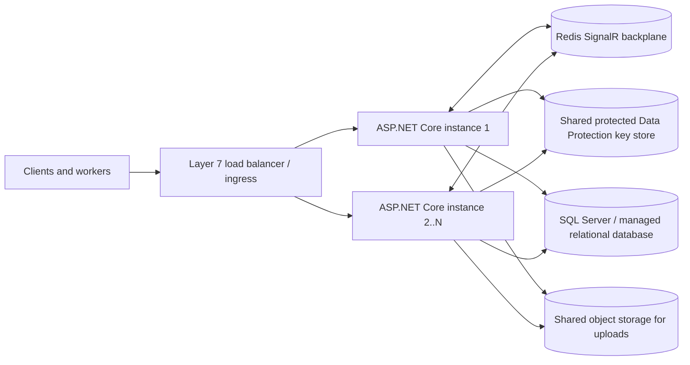

# Scaling and production operations

The application is now prepared for multiple stateless ASP.NET Core instances, but actual capacity depends on the chosen host, database tier, workload, and load-test results. Do not treat a successful build as a capacity guarantee.

## Reference topology

## Application settings for scale-out

- `SignalR:Redis:ConnectionString` (environment variable `SignalR__Redis__ConnectionString`) enables the Redis SignalR backplane. Use a private, TLS-protected Redis endpoint and store credentials in the deployment secret store, not source control. `SignalR:Redis:ChannelPrefix` (or `SignalR__Redis__ChannelPrefix`) isolates this app/environment. Without the Redis setting, SignalR broadcasts are local to one process; do not run multi-instance chat without a managed SignalR service or a shared backplane.
- `DataProtection:KeysPath` (or `DataProtection__KeysPath`) must point at durable storage shared by all app instances. Protect the key ring at rest with a platform key-encryption mechanism/Key Vault and restrict filesystem access. Every instance uses the same application name (`WorkerBookingSystem`) so authentication cookies and antiforgery tokens can be decrypted across instances.
- Set `ConnectionStrings__DefaultConnection` to a production SQL Server endpoint. The checked-in LocalDB connection is for local development only. Use a private network path, encrypted connections, managed identity where supported, and a least-privilege database principal.
- When TLS terminates at a reverse proxy/load balancer, configure its private IP addresses as `ForwardedHeaders__KnownProxies__0`, `ForwardedHeaders__KnownProxies__1`, etc. The app only trusts forwarded client/protocol headers from those addresses; do not trust arbitrary Internet-supplied forwarded headers. Alternatively, use TLS pass-through.
- `AddDbContextPool` reuses EF Core contexts within each process. Keep contexts request-scoped and do not attach per-request mutable state to the context. SQL client connection pools are per process: size the SQL connection pool and database capacity against the maximum replica count, not one instance alone.
- User profile files are currently written under the app's local `wwwroot` directory. Before running more than one instance, move uploads to shared object storage (or a shared mounted volume) and serve them through a CDN; otherwise instances can show different/missing files.

## Load balancer and autoscaling

- Put at least two instances behind an HTTPS layer-7 load balancer with WebSocket support, graceful draining, and health probes. Route `/health/live` as liveness and `/health/ready` as readiness; readiness checks SQL connectivity.
- With the Redis SignalR backplane, configure load-balancer session affinity/sticky sessions as required by the SignalR transport, and retain WebSocket support. Alternatively, use a managed SignalR service integration and follow that service's routing guidance.
- Autoscale on sustained CPU/memory, request latency, and queue/connection saturation with conservative minimum/maximum replica counts. Set a per-instance SQL connection budget so maximum web replicas cannot overwhelm the database.
- Message and support writes have per-process ASP.NET Core rate limits. With multiple replicas, enforce additional global per-user/IP limits at the ingress/API gateway/WAF; local limiter counters are not shared between instances.
- Use CDN caching for static assets. Keep authenticated HTML, payment, booking, ticket, and API responses private/no-store. Avoid caching user-specific responses at the edge.

## Database and rollout

- Use a production SQL tier sized from representative load tests; configure automatic backups, point-in-time restore, zone/region resilience appropriate to the recovery objectives, alerting, and query/connection monitoring.
- Keep the existing pagination and query projections. Review actual query plans and wait/lock statistics before adding indexes or read replicas. Booking, payment, wallet, identity, and ticket writes must go to the primary database; read replicas require explicit stale-read-tolerant read paths and are not a transparent replacement.
- Application startup no longer runs schema and identity initialization on every production replica by default. Apply EF migrations once as a release/deployment step before routing traffic. For a one-off migration process only, `Database:InitializeOnStartup=true` opts into startup initialization; never enable this on a concurrently starting replica fleet.
- For a brand-new database, first apply migrations, then run exactly one controlled app instance with `Database:InitializeOnStartup=true` to create the built-in roles and optionally seed the configured admin. Turn the setting off before starting the replica fleet. Existing installations that already created those roles do not need this bootstrap step.
- Deploy backward-compatible schema changes before code requiring the new schema, then expand/contract in separate releases if rolling deployment overlaps old and new application versions.

## Load test

The k6 smoke/load script in `performance/k6-smoke.js` exercises the home page, worker search, and readiness probe. Run it against a staging deployment, increase virtual users gradually, and watch p50/p95/p99 latency, HTTP errors, application CPU/memory, SQL CPU/DTU/vCore, connections, waits, and Redis health. Do not run high-volume tests against production without an approved test window and limits.

Suggested staged process: smoke at 1 VU, ramp to expected peak traffic, then test a short burst above peak. Record the tested deployment, dataset, duration, peak VUs, error rate, and database tier; define capacity from the first saturation/latency threshold rather than guessing a user count.